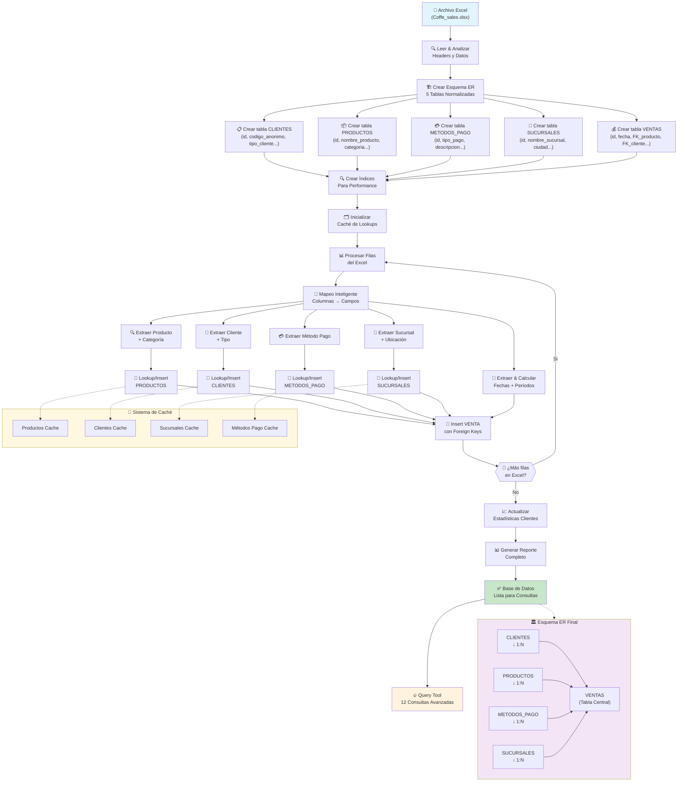
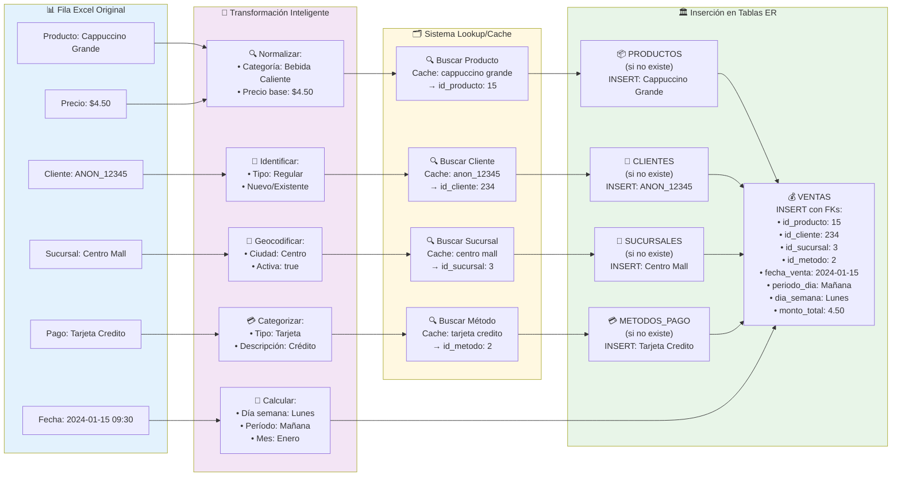

# ☕ Coffee Sales Excel to SQLite Importer

Un sistema profesional para convertir datos de ventas de café desde Excel a una base de datos SQLite con esquema ER apropiado.

## 🚀 Instalación

```bash
# Instalar dependencias
npm install

# O si prefieres yarn (aunque honestamente, npm está bien)
yarn install
```

## 📊 Uso

### 1. Analizar el archivo Excel primero (recomendado)

Antes de importar todo como un salvaje, analiza qué contiene tu archivo:

```bash
npm run analyze
```

Esto te mostrará:
- 📋 Estructura de las hojas de cálculo
- 🔍 Tipos de datos inferidos
- 🎯 Esquema ER sugerido
- 🔗 Relaciones potenciales

### 2. Importar datos a SQLite

Una vez que sepas qué tienes, importa los datos:

```bash
npm start
```

El script:
- ✅ Crea un esquema ER inteligente
- 🔄 Transforma tipos de datos automáticamente
- 📚 Añade índices para mejor rendimiento
- 🛡️ Maneja errores de datos graciosamente
- 📈 Genera un reporte de resumen

### 3. Consultar la base de datos

Explora tus datos importados:

```bash
node query-db.js
```

Características del query tool:
- 🔥 Consultas predefinidas para análisis común
- 💬 Modo interactivo con prompt SQL
- 📊 Visualización de resultados en tabla
- 🔍 Detección automática de columnas relevantes

## 📁 Archivos Generados

- `coffee_sales.db` - Base de datos SQLite con tus datos
- `package.json` - Dependencias del proyecto
- Logs de importación en la consola

## 📊 Diagramas del Proceso

### Flujo Principal de Importación



### Transformación de Datos por Fila



## 🔧 Características Técnicas

### Esquema ER Profesional
Implementa exactamente el diagrama ER proporcionado con:
- **5 Tablas Normalizadas**: `clientes`, `productos`, `metodos_pago`, `sucursales`, `ventas`
- **Relaciones Foreign Key**: Integridad referencial completa
- **Índices Optimizados**: Para consultas de alto rendimiento
- **Campos Calculados**: Derivaciones automáticas (día de semana, período del día, etc.)

### Normalización Inteligente
- **Lookup Tables**: Crea automáticamente registros de productos, clientes, sucursales
- **Deduplicación**: Evita duplicados usando caché inteligente
- **Mapeo Flexible**: Reconoce columnas del Excel por nombres similares
- **Estadísticas Cliente**: Calcula automáticamente totales de compras y fechas

### Transformación de Datos Avanzada
- **Fechas y Horas**: Extrae fecha, hora, día de semana, mes, período del día
- **Montos**: Calcula totales basados en precio unitario × cantidad
- **Categorización**: Clasifica automáticamente datos por tipo
- **Validación**: Maneja errores graciosamente con reportes detallados

### Estructura de la Base de Datos ER

El sistema implementa exactamente este esquema normalizado:

```
📋 CLIENTES
├── id_cliente (PK)
├── codigo_anonimo 
├── tipo_cliente
├── fecha_primer_compra
├── fecha_ultima_compra
├── total_compras (calculado)
├── monto_total_gastado (calculado)
└── fecha_creacion

📦 PRODUCTOS  
├── id_producto (PK)
├── nombre_producto
├── categoria
├── precio_base
├── activo
├── fecha_creacion
└── fecha_actualizacion

💳 METODOS_PAGO
├── id_metodo_pago (PK)
├── tipo_pago
├── descripcion
├── activo
└── periodo_dia

🏪 SUCURSALES
├── id_sucursal (PK)
├── nombre_sucursal
├── direccion
├── ciudad
├── activa
├── fecha_apertura
└── fecha_creacion

💰 VENTAS (tabla principal)
├── id_venta (PK)
├── fecha_venta
├── fecha_hora_venta
├── hora_del_dia
├── id_producto (FK → productos)
├── id_metodo_pago (FK → metodos_pago)
├── id_cliente (FK → clientes)
├── id_sucursal (FK → sucursales)
├── precio_unitario
├── cantidad
├── monto_total
├── periodo_dia (Mañana/Tarde/Noche)
├── dia_semana
├── nombre_mes
├── numero_dia_semana
├── numero_mes
├── fecha_creacion
└── fecha_actualizacion
```

### 12 Consultas Predefinidas Avanzadas
1. **Ventas Recientes**: Con nombres de productos y sucursales
2. **Resumen por Producto**: Análisis completo de performance
3. **Totales Diarios**: Tendencias temporales detalladas
4. **Top Productos**: Ranking por unidades vendidas
5. **Tendencias Mensuales**: Análisis de estacionalidad
6. **Análisis de Clientes**: Segmentación VIP/Premium/Regular
7. **Performance Sucursales**: Comparación entre tiendas
8. **Métodos de Pago**: Preferencias y distribución
9. **Ventas por Hora**: Análisis de períodos del día
10. **Categorías**: Performance por tipo de producto
11. **Esquemas**: Estructura completa de la base de datos
12. **Estadísticas**: Resumen ejecutivo de registros

## 🎯 Mejores Prácticas

### Para Datos de Ventas de Café
El sistema está optimizado para reconocer automáticamente:
- `product`, `item`, `coffee_type` → Productos
- `price`, `amount`, `total` → Montos monetarios
- `quantity`, `count` → Cantidades
- `date`, `timestamp` → Fechas/tiempos
- `customer`, `client` → Información de clientes

### Consejos de Rendimiento
- **Índices automáticos** en columnas ID, fecha y cliente
- **Tipos de datos optimizados** para cada columna
- **Transacciones por lotes** para imports grandes
- **Manejo de errores** que no interrumpe el import completo

## 🚨 Solución de Problemas

### Error: "File not found"
- Verifica que `Coffe_sales.xlsx` esté en el directorio
- Revisa la ortografía del nombre del archivo

### Error: "Cannot read Excel file"
- Asegúrate que el archivo no esté abierto en Excel
- Verifica que sea un archivo Excel válido (.xlsx)

### Datos no se importan correctamente
- Ejecuta `npm run analyze` primero
- Revisa que las columnas tengan headers válidos
- Verifica que no haya celdas combinadas en los headers

### Performance lenta
- El script crea índices automáticamente
- Para archivos >100k filas, considera dividir los datos
- SQLite puede manejar millones de filas sin problemas

## 🔮 Próximas Características

- [ ] Exportar resultados a CSV
- [ ] Interfaz web para consultas
- [ ] Detección automática de relaciones FK
- [ ] Validación de datos pre-import
- [ ] Soporte para múltiples archivos Excel
- [ ] Generación de reportes PDF

## 🤝 Contribuir

Si encuentras bugs o tienes ideas brillantes:
1. Fork el repo
2. Crea una branch con nombre descriptivo
3. Haz tus cambios sin romper nada
4. Submit un PR con explicación clara

## 📄 Licencia

MIT - Haz lo que quieras, pero no me culpes si explota

---

*Built with ☕ and a healthy dose of sarcasm by a senior dev who's tired of Excel chaos*# carga-de-documento-xlsx-a-sqlite
